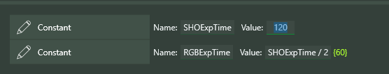
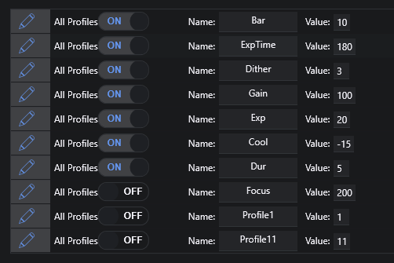

# **Constants/Variables/Expressions**

## **Expressions**

An **Expression** in Sequencer Powerups is pretty much any kind of mathematical expression using numbers (fixed or floating point), **Constants**, and **Variables**, plus **Device Data** (various data from your devices); currently supported **Device Data** values are documented below.  *Note that **Device Data** values are only available if the appropriate gear is connected!*

**Expressions** can be used in "enhanced" instructions (enhanced in the sense that they accept **Expressions** in place of numbers), as well as some new instructions like **If** and **Loop While**. Enhanced instructions are named with "+" appended to the instruction name (e.g. **Take Exposure +**, **Cool Camera +**, etc).
So, for example, in **Take Exposure +**, the value of Exposure Time might be `10` or `ExpTime` (assuming `ExpTime` is defined as a **Constant** or **Variable**; see below) or even `ExpTime / 3` or a conditional like `if (rgb, ExpTime, ExpTime*2/3)`.  In the latter case, the "if" predicate takes three arguments: something can be tested for true/false (1/0), a value if "true", and a value if "false".

### What's Valid in an Expression

Valid tokens in **Expressions** include numbers, parentheses, function and operator names (see [Appendix](#appendix-functions-and-operators-in-expressions)), **Constant** and **Variable** names, the names of gauges, switches, and other **Device Data** (if these devices are connected in NINA), and the reserved names **TIME**,  **SAFE**, and **EXITCODE** (see [ReservedVariables](#reserved-variables)).

## **Constants**

A **Constant** in Powerups is created using the **Constant** instruction; enter a name for the **Constant** and a value, which can be any valid expression (if the value refers to another **Constant**, that **Constant** needs to have been defined in the same instruction set or in a parent of the instruction set).  The **Constant** instruction is *self-executing* and continuously re-evaluated!  This means that **Constants** are "live" as they are read into the sequencer, and their values update as required, based on changes to other **Constants** that might have been referred to.  When the Sequencer executes a **Constant** instruction, literally nothing happens!  *Note: A Constant definition cannot reference Variables*

The value of a **Constant** can be changed at any time (even when a Sequence is running) and all references to that **Constant** are updated semi-immediately (within a couple seconds).  It's not a very good constant, is it?

Note that the calculated value of an **Expression** is shown in braces next to the **Expression** defining it. The value is shown in green if valid, and orange if not. Note that **Constant** (and **Variable**) names are *case sensitive*, as in the definition of 'E' in the screenshot above.

**Constants** have block scope, which means that a **Constant** has a value in the instruction set that includes it, as well as instruction sets "below" it in the hierarchy of instructions (i.e. nested within the block in which it appears).  If a **Constant** X is defined in one instruction set, and a **Constant** X is also defined in a "lower" instruction set, the closest definition of X is used when that **Constant** is referenced.  Many computer languages use block scope for variables.

**Global Constants** are **Constants** that are valid everywhere in a sequence; they are set up in the Sequencer Powerups plugin page.  **Global Constants** can, individually, be set up to be valid for all NINA Profiles or on a per-Profile basis.

## **Variables**

A **Variable** in Powerups is more similar to a traditional computer language variable; it also uses "block scope" (except for **Global Variables**; see below).   A **Variable** is defined using the **Variable** instruction, which is entirely analogous to the **Constant** instruction, except that **Variable** definitions are *not* self-executing - the **Variable** does not have a value prior to the execution of the **Variable** instruction.   References to a **Variable** "below" it in the code will show `Not evaluated: <varname>` until the **Variable** instruction gets executed.
The **Set Variable** instruction can be used to change the value of a previously defined **Variable**.  For a value, any **Expression** can be used - including the use of **Constants** and **Variables** that have been previously defined.  The simplest form of this might this:

Just as in a procedural computer language, if you are looping through an instruction set, any **Variables** defined in that instruction set are reset to having no value before the loop repeats!

### Variable Instructions

**Variable** : Creates and defines the initial value of a **Variable** *when it is executed*.

**Set Variable** : Redefines the value of a previously created **Variable**

**Set Variable to Date** : Redefines the value of a previously created **Variable** to a date and time, using the same mechanism as the built-in **Loop Until Time** interface (i.e. clock time, and time offset from meridian and the various forms of sunrise and sunset).  *Note: Internally, dates are represented by an integer, the number of seconds from midnight January 1, 1970 UTC*

**Global Variable** : Creates and defines a **Variable** that can be used anywhere in a sequence, *once the instruction has been executed*.  **Global Variables** are the *only* variables that can be used across sequencer sections (where a section is one of "Start Area", "Target Area", and "End Area").  The value of a **Global Variable** can be changed with either of the two instructions above (**Set Variable** and **Set Variable to Date**).

## Embedded Instructions

Many Powerups include what I call **Embedded Instructions**; these are NINA instructions that are *embedded* within the Powerups instruction, in much the same way that instructions are embedded in NINA's instruction sets.  A typical example is the **If** instruction (documented just below).  When an **If** is dragged into a sequence, it looks like this:

To add **Embedded Instructions**, you simply drag them into the space marked "Conditional instructions go here", as below.  In the following example, the two embedded instructions will be executed when WindGust is greater than 5.

To save screen real estate, **Embedded Instructions** can be hidden with the arrow at the upper left of the instruction.

## Captured Instructions

Another concept Powerups uses is the idea of a **Captured Instruction**.  Instructions that use this concept work on another NINA instruction, executing it and (usually) acting on the result.  Here's one...

The **If Failed** instruction, for example, executes its **Embedded Instructions** if the execution of the **Captured Instruction** fails.   Here I am dragging a **Run Autofocus** instruction into the **If Failed**.

And here's how it looks with the **Run Autofocus** captured, and with a **Send to Pushover** instruction added as an **Embedded Instruction**.   If the **Run Autofocus** fails, the message will be sent by Pushover.

## **If and IfThenElse (instructions), When (trigger), and Loop While (condition)**

### If and IfThenElse

The **If** instruction evaluates the given **Expression** and runs the specified instructions if that **Expression** is not false (not 0 or "false").  The **IfThenElse** instruction adds the ability to specify instructions to execute if the **Expression** is false (or 0).

### When

The **When** trigger is activated *when* the given expression is not false (not 0 or "false') and runs the specified instructions. There is a **Once Only** toggle in this instruction; setting this to ON will cause this trigger to run only once during execution of your sequence. There is also a **Interrupt** toggle; if set to 'ON' (the default), the **When** trigger will interrupt any instruction in progress (the check is performed approximately every 5 seconds).

*The **Interrupt** functionality of the **When** trigger is unlike traditional NINA triggers that only run between the execution of instructions!*

#### Warnings for the When Trigger
 If you don't somehow arrange for the **Expression** to become false during the execution of the included instructions, the **When** trigger will run every five seconds (after finishing those instructions).  If you want to keep this from happening, set the **Once Only** toggle to ON!

### Loop While

**Loop While** is a standard NINA "Conditional" and gets placed with other conditionals in an instruction set.   When queried (every 5 seconds or so while a sequence is running), it evaluates the given **Expression** and terminates the loop if the result is "false" or 0.

Here’s an example of a very simple instruction set using **Variable**, **Set Variable**, and **Loop While**.  Note that the **Variable** instruction needs to be outside the loop; otherwise the `Lp` variable will be reset to 10 every time the loop is restarted!

Note the red "i" (for "Information") icon in the **Loop While** instruction.  Hovering over this icon will show all of the possible gauge, switch, weather, and camera data that can be used in the Exporession (this appears in both **If** and **Loop While** instructions). Here's what this might look like for you, depending on what devices you have connected at the time:

Here's an interesting example that uses these instructions to implement a timeout. The **Loop While** is basically running for up to 60 seconds OR until the **confirmed** **Variable** becomes true.  Each time through the loop, the **If** instruction checks whether a switch (in this case, **GuideScopeOpen**) has become "true"; if so, the **Set Variable** instruction sets **confirmed** to true.  This ends the loop.

Presumably, when this loop finishes, another test of **GuideScopeOpen** will be used to determine whether the opening procedure has succeeded. If not, perhaps a **Ground Station plugin** message will be sent, or the sequence terminated.

## Constant/Variable Container

A **Constant/Variable Container** is a special kind of container that can hold only **Constant**, **Variable**, and **Annotation** instructions.  Its intended use is to "clean up" sequences with many **Constant** and **Variable** definitions.  What makes this container special is that **Constants** and **Variables** defined within it *act as though they were defined at the level of the container (or **Template by Reference**) that they are enclosed in*.

In the example below, the **Constant** X2 definition, using the **Constant** X, would be undefined if X had not been defined in the **Constant/Variable** container used in the **Template by Reference**.

In a regular sequential instruction set, the **Variable** X is not in scope when evaluating X2.

## Imaging Page Dockable

There is a dockable panel in the Imaging page of NINA that can be used to "watch" any number of **Expressions** in real-time.  More to follow.

## Reserved Variables

The following Variable/Constant names are reserved:

**SAFE** &ensp; - &ensp; See the documentation for "Safety"

**TIME** &ensp; - &ensp; The current time in seconds since NINA was started, with an accuracy of 10 seconds or so. This is not intended, obviously, for highly accurate timing, but can be used, for example, with the **When** trigger to take actions at various intervals.

**EXITCODE** &ensp; - &ensp; The EXITCODE from a call to the **External Script +** command (see later in this document)

## Device Data

The following **Device Data** is available if the associated device is connected in NINA.  Note that this list is added to frequently, often upon request by users.

**Astrometry** data: **SunAltitude**, **MoonAltitude** (no device needed)

**Camera** data: **SensorTemp**

Camera data (hidden): **camera__PixelSize, camera__XSize, camera__YSize, camera__CoolerPower, camera__CoolerOn**

**Dome** data:  **DomeStatus, DomeAzimuth**

DomeStatus constants: **ShutterNone, ShutterOpen, ShutterClosed, ShutterOpening, ShutterClosing, ShutterError**

**Filter Wheel** data: **CurrentFilter**

CurrentFilter constants: **Filter_name**, where "name" is the name of the filter with all non-alphanumeric characters removed.  So a filter named "My IR Filter" must be referred to as Filter_MyIRFilter.

**Flat Device** data: **CoverState**

CoverStatus constants: **CoverOpen, CoverClosed, CoverNeitherOpenNorClosed, CoverUnknown, CoverError**

**Last Image** data: **Image_HFR**, **Image_StarCount** (if Hocus Focus is being used for star analysis, **Image_FWHM** and **Image_Eccentricity** are also available)

**Roof** data: **RoofStatus**

RoofStatus constants: **RoofOpen**, **RoofNotOpen**, **RoofCannotOpenOrRead** (note: **RoofStatus** requires the use of a RoofStatus file that can be defined in the Powerups settings)

**Rotator** data: **RotatorMechanicalPosition**, **RotatorPosition** (these are the same)

**Safety Monitor** data: **IsSafe**

**Telescope (Mount)** data: **Altitude**, **Azimuth**, **RightAscension**, **Declination**, **AtPark**

## **Odds and Ends**

•	Wherever **Expressions** are used, the current value of that **Expression** is shown in brackets { }, in green if valid and in orange if invalid (not defined, etc.)  These colors are currently fixed, and only appear nicely in certain color schemes; sorry about that!  Here's a rather useless example:

 
•	Up to 10 **Global Constants** can be defined on the plugin page; each of them can be set for *all* of your NINA Profiles, or can be set on a per-profile basis.

•	Hovering over an **Expression** will show the current value of any **Constants** and **Variables** that are used in that **Expression**.  In the example below, the **Constant** A is defined "Here" (meaning in the current block) and has a value of 8; the **Constant** CHATTER is defined globally and has a value of 200.

 
•	**If** and **Loop While** instructions show the current result of the **Expression**.

•	There is a **Breakpoint** instruction that stops sequence execution until you press the "Continue" button that appears when a breakpoint is hit.  The **Breakpoint** instruction is exactly equivalent to **Wait for Time Span** of twelve hours.

 
## **Summary**

 **Constants** have the same value throughout a sequence (in their scope) and do not change during sequence execution (or more precisely are not changed *because* of sequence execution).  A human can change them, and that change takes effect immediately, but the sequence itself does not change them.  **Variables**, on the other hand, are created and changed by sequence execution, without human intervention.  However, you can always manually change the values of both **Variables** and **Constants** during execution, just as you can reorder instructions and do other dastardly things to yout sequence (with great power comes great responsibility).  *Just remember that manual changes can have side effects that might be unexpected!*

## **Appendix: Functions and Operators in Expressions**

These are the valid functions that can be used in Expressions.

| Method      | Description                          |
| ----------- | ------------------------------------ |
| `Abs`       | Returns the absolute value of a specified number  |
| `Acos`      | Returns the angle whose cosine is the specified number |
| `Asin`    | Returns the angle whose sine is the specified number |
| `Atan`    | Returns the angle whose tangent is the specified number |
| `Ceiling`    | Returns the smallest integer greater than or equal to the specified number |
| `Cos`    | Returns the cosine of the specified angle |
| `Exp`    | Returns e raised to the specified power |
| `Floor`    | Returns the largest integer less than or equal to the specified number |
| `Log`    | Returns the logarithm the specified number |
| `Log10`    | Returns the base 10 logarithm the specified number |
| `Max`    | Returns the larger of two specified numbers |
| `Min`    | Returns the lesser of two specified numbers |
| `Pow`    | Returns the specified number raised to specified power |
| `Round`    | Rounds a value to the nearest integer or specified number of decimal places |
| `Sign`    | Returns a value indicating the sign of a number |
| `Sin`    | Returns the sine of the specified angle |
| `Sqrt`    | Returns the square root of the specified number |
| `Tan`    | Returns the tangent of the specified angle
| `Truncate`    | Calculates an integral part of a number |
| `if`    | Returns whether an element is in a set of values - if(expr, then, else) |
| `in`    | Returns a value based on a condition |

| Date/Time      | Description                          |
| ----------- | ------------------------------------ |
| `now`       | Returns the current date/time  |
| `hour`      | Returns the hour (Midnight = 0, 11PM = 23) |
| `minute`    | Returns the minute of the hour |
| `day`    | Returns the day of the month |
| `month`    | Returns the month (January = 1) |
| `year`    | Returns the year |
| `dow`    | Returns the day of the week (Sunday = 0) |

Here are the valid operators in Expressions

| Method      | Description                          |
| ----------- | ------------------------------------ |
| `Arithmetical`    | - , &ensp; + ,&ensp;  *,&ensp; /,&ensp; %|
| `Logical`    | &&, &ensp; \|\|, &ensp;  !|
| `Bitwise`    | &, &ensp;\|,&ensp; ^, &ensp;~, &ensp;<<,&ensp; >>|
| `Comparison`    | ==,&ensp;!=,&ensp; >,&ensp; <,&ensp; >=, &ensp;<=|

