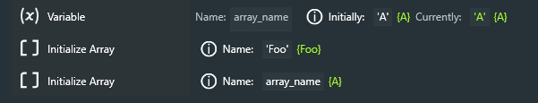
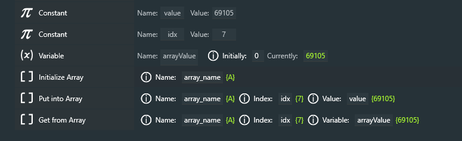

# **Arrays**

Powerups provides a simple facility for creating and using one-dimensional arrays.  Powerups **Arrays** aren't traditional arrays in the computer language sense (an ordered structure, typically starting with index 0), but rather an *associative* array, or *dictionary*, whose index and value can be either numeric or a string (within single quotes).  When looping through an **Array**, values will be retrieved in *arbitrary* order, unless they have numeric indices.

### Array Names

**Array** names are strings, alphanumeric characters surrounded by single or double quotes, e.g. 'MyArray'.  They are *not* **Variables** or **Constants**, and cannot be used like them.

### Initialize Array

This instruction creates or re-initializes an already created **Array**; after this instruction is executed, the **Array** can be used in other instructions (below).  An initialized **Array** has no contents.

Note that the name of the **Array** can either be a literal string (in quotes) or a **Variable** whose value is a literal string.

### Put into Array / Get from Array

These two instructions do pretty much what you'd expect; inserting and retrieving elements of the **Array**.

### For Each in Array

### Functions that can be used with Arrays

**length**('array') returns the number of elements in the **Array**

**sumOfValues**('array') returns the sum of all of the elements in an **Array**

**averageOfValues**('array') returns the average of all of the (numeric) elements in an **Array**

