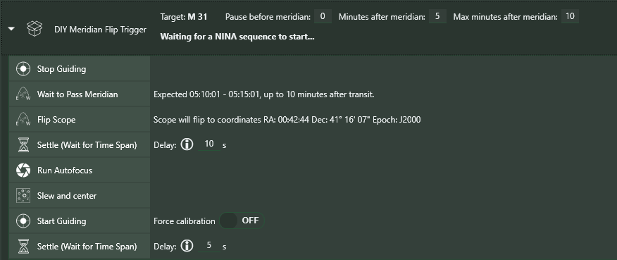

**DIY Meridian Flip** is a Trigger that effectively "deconstructs" the standard NINA Meridian Flip Trigger.  The best way to describe this is to show what it looks like when you first expand this trigger:

Note that "inside" the trigger are eight NINA instructions that correspond to the actions that NINA takes during a Meridian Flip. Most of these instructions are standard in NINA, with the exception of two that are not normally exposed in NINA.  These are:

1) **Wait to Pass Meridian**  This instruction, as it implies, waits until your target (or telescope, if there's no active target but your mount is tracking) crosses the Meridian and is, therefore, presumably ready to "flip"

2) **Do Flip**  This instruction actually performs the "flip", which is done by slewing the telescope to the target's current position (if, indeed, your mount is past the Meridian, this should cause the flip to occur).  Note that NINA cannot actually "flip" the scope; your mount must be set up so that a flip will occur when required.

As with many of the other Powerups instructions, you can feel free to change the order of the instructions inside DIY Meridian FLip, remove or add instructions, etc.  It is your responsibility to make sure the instructions, and their ordering, *make sense*!  For example, putting **Do Flip** before **Wait to Pass Meridian** is likely to be a bad mistake.

Note also that "Pause Before Meridian", "Minutes After Meridian", and "Max Minutes After Meridian" settings in **DIY Meridian Flip** take, as their default, the standard NINA settings for Meridian Flip; however, you can change these to override those settings.