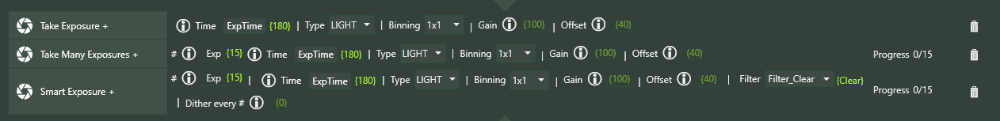

**Enhanced Instructions** are built-in NINA instructions that have been enhanced to allow the use of **Expressions**.  These instructions take the name of the existing NINA instruction and put a plus-sign (+) at the end.  More instructions will be enhanced in the future.

## Take Exposure +, Take Many Exposures +, and Smart Exposure +

These imaging instructions allow **Expressions** for number of exposures, exposure time, gain, offset, and dither.  In the examples below, the **Constants** used are defined elsewhere. *Note: Filter, and binning are planned for the future.*

## Trained Flat Exposure +, Trained Dark Flat Exposure +

These imaging instructions allow **Expressions** for number of exposures, gain, and offset.  In the examples below, the **Constants** used are defined elsewhere. 

## Cool Camera +

This instruction can use **Expressions** both for the set temperature and duration.

## Move Focuser Relative + / Move Focuser Absolute +

## Switch Filter +

Allows use of an **Expression** to specify a filter.   Note that filter names are represented by `Filter_filterName`, where `filterName` is the name of a filter without spaces or other punctuation.

## Move Rotator Mechanical +

Use an **Expression** to specify a mechanical rotator angle.

## Slew to RA/Dec and Center +

Slew to RA/Dec using an **Expression** to specify decimal coordinates, and center.

## Send with Ground Station

Drag a Ground Station plugin instruction into this one, then specify a Title and Message.  The Message can include any number of **Expressions** surrounded by curly brackets.

## Add Image Pattern

You provide a name for the pattern (e.g. FOO) and a new image pattern $$FOO$$ becomes available for use when you take images.  The **Expression** you provide in the instruction is evaluated when an image file is created, and that value is used as the value of the pattern you added.  *Note: The pattern is added once a name, value (any Expression you like), and a description are added to the instruction.*  *Note: The instruction is self-executing, like Constant.  It does not need to be executed; just adding or loading it is enough.*  *Note:  There's currently no way to change or remove a file pattern token, so if you change the name or description inside the Add Image Pattern instruction, nothing will happen (at least until you start NINA again)*  

## External Script +

This is fully documented elsewhere in this document.

## Wait for Time Span +

Allows use of an **Expression** to specify a wait time (in seconds)

## Annotation +

This instruction allows the use of **Expressions** within the annotation; each **Expression** must be surrounded by {}'s.

