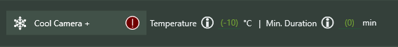

**Enhanced Instructions** are built-in NINA instructions that have been enhanced to allow the use of **Expressions**.  These instructions take the name of the existing NINA instruction and put a plus-sign (+) at the end.  More instructions will be enhanced in the future.

## Take Exposure +, Take Many Exposures +, and Smart Exposure +

These imaging instructions allow **Expressions** for number of exposures, exposure time, gain, offset, and dither.  In the examples below, the **Constants** used are defined elsewhere. *Note: Filter, and binning are planned for the future.*

## Trained Flat Exposure +, Trained Dark Flat Exposure +

These imaging instructions allow **Expressions** for number of exposures, gain, and offset.  In the examples below, the **Constants** used are defined elsewhere. 

## Cool Camera +

This instruction can use **Expressions** both for the set temperature and duration.

## Move Focuser Relative + / Move Focuser Absolute +

## Switch Filter +

Allows use of an **Expression** to specify a filter.   Note that filter names are represented by `Filter_filterName`, where `filterName` is the name of a filter without spaces or other punctuation.

## Move Rotator Mechanical +

Use an **Expression** to specify a mechanical rotator angle.

## Slew to RA/Dec, Slew to RA/Dec and Center +, Slew to Alt/Az

Slew to RA/Dec (or Alt/Az) using an **Expression** to specify decimal coordinates, and (optionally) center.

## External Script +

This is fully documented elsewhere in this document.

## Wait for Time Span +

Allows use of an **Expression** to specify a wait time (in seconds)

## Annotation +

This instruction allows the use of **Expressions** within the annotation; each **Expression** must be surrounded by {}'s.

