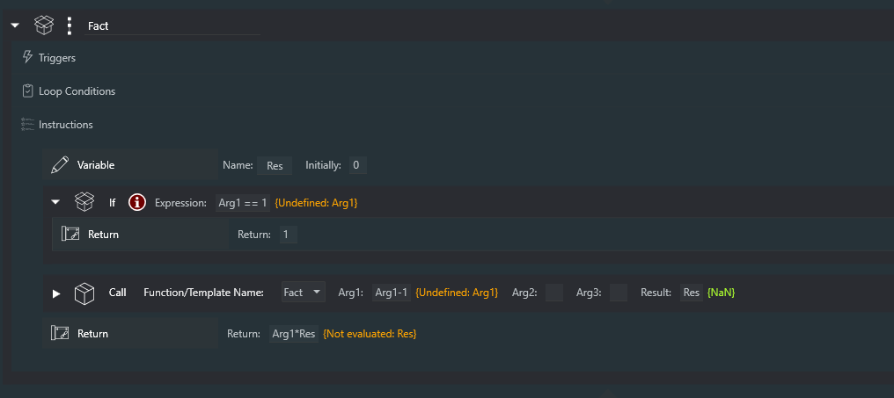

#Functions

##What are they?

Functions are Templates that can be called with up to three arguments, and can return a value (by setting a **Variable**).  They are similar to **Template by Reference** in that they refer to a Template by name, but they act somewhat differently as will be described below.

*Note: This is a new implementation and I'm sure some edge cases will have issues!  Please report them to me in the \#Sequencer-Powerups channel of the NINA Discord server*

##What are They For?

I'm not really sure, so I'm hoping you'll let me know if you find a use for them (other than demonstrating the power of NINA's plugin system).

##The **Call** and **Return** instructions

The **Call** instruction can specify up to three arguments, and a **Variable** name that can store a return value.  *All three arguments, as well as the return value, are optional.*  A **Call** with neither arguments nor a return value is simply another way of executing a Template.  Arguments can be passed by value or by reference.  To pass an argument by reference, use an underscore as a prefix before the name of the **Variable**.   So the argument "Count" refers to the *value* of the Count **Variable**; the argument "_Count" refers to a *reference to the Count variable*. For those unfamiliar with the concept of a "reference" (also called a "pointer"), read on.

A **Function** is just a Template, but when it's used, there are some differences:

1) The template is loaded *when it is called*, which is unlike **Template by Reference** (TBR) which loads the template when the TBR is loaded into the sequence.

2) The **Variables** Arg1, Arg2, and Arg3 are assigned to the arguments specified in the **Call** instruction (all three are optional). If an argument is of the form "_xxx", where xxx is the  name of a **Variable**, then the argument is passed as a *reference* to the **Variable** specified.

3) The (new) **Return** instruction can be used at any time in the Template to cause the called Template to return.  If a value is included in the **Return** instruction, and if there is a **Variable** specified in the **Call** instruction, that **Variable** will be assigned the **Return** value.

Here's an example of an argument passed by value.  Below, the code has run; the Template "ReferencedFunc" has been called, and the **Loop While** has run 10 times, ending with Arg1 having a value of zero.  The **Loop While** expression is false.

Here's the same example, but the argument is passed as a *reference* to the **Variable** V.  The result is very similar; the **Loop While** runs 10 times, the Arg1 **Variable** decrements to zero, but notice that the *reference* **Variable** V is now also zero.   That's because, while executing the **Template**, the instruction **Set Variable** of Arg1 is actually setting the value of **Variable** V that Arg1 references.  *The distinction is important!*

And here's the Template "ReferencedFunc".  You'll notice that the **Variable** Arg1 appears undefined, which makes sense actually; it will get defined automatically when the Template is **Call**ed.

##Recursion

Yes, Powerups **Functions** can be recursive.  Here's a Template called "Fact" that calculates "factorial" of its argument.

And here's 8! (8 factorial, as calcualted by the Sequencer)

