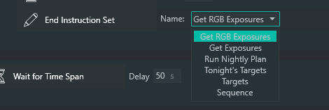

# This & That

Here are some other instructions you might find useful...

## Repeat Until All Succeed

This instruction will loop through the included instructions until none of them fail.  This might be useful at startup time to make sure all of your equipment is running properly before starting imaging. As soon as any of the instructions fails, NINA will pause for the amount of time you specify and then try again.

## Wait Indefinitely

This instruction, well, waits indefinitely.

## Breakpoint

This is exactly the same as **Wait Indefinitely** except that it throws up a NINA warning.

## End Sequence

This instruction ends the entire sequence that is running.

# End Instruction Set

This instruction terminates the instruction you specify, anywhere in the hierarchy of running instructions.

