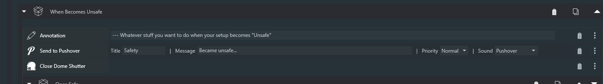
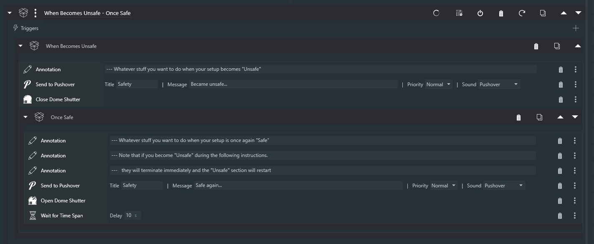
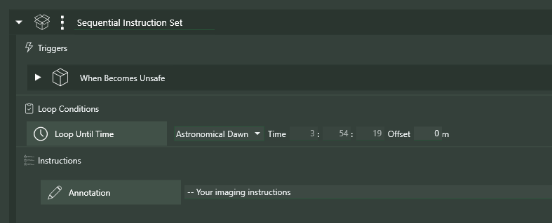

Sequencer Powerups has a number of instructions that help with the handling of safe/unsafe conditions. All of these instructions require that an ASCOM-compilant Safety Monitor is connected to NINA.

Generally, imagers will want to execute some kind of "subroutine" when their gear becomes "unsafe", and then  return to their imaging if and when their gear becomes "safe" again. The following instructions were designed exactly for this purpose.

## When Becomes Unsafe

The **When Becomes Unssafe** trigger allows you to specify a set of instructions to execute within a couple of seconds of your gear becoming "unsafe". Typically, these intructions might include **Close Dome Shutter**, **Park Scope**, an instruction to send yourself a notification (as with the Ground Station plugin), and things of that sort.

## Once Safe and Wait for Safe +

One of these two instructions will almost always be used after the instructions that put your gear into a safe configuration.

### Once Safe

The **Once Safe** instruction is the preferred way of continuing to image after **When Becomes Unsafe** is triggered.  As with **When Becomes Unsafe**, you add instructions within **Once Safe** that get your gear ready to continue imnaging.  Typically, this would include instructions to open a dome, unpark your mount, slew back to your target, start guiding, perhaps autofocus, etc.   When the last of these instructions is executed, NINA will go right back to what it was doing when WBU was initially executed.   Here's a typical **When Becomes Unsafe** instruction including a **Once Safe** clause.

### Wait for Safe +

The **Wait for Safe+** instruction can also be used within the **When Becomes Unsafe** instruction; this, as you'd expect, simply waits for conditions to become safe again and then continues, typically with instructions, as with **Once Safe**, that prepare your gear for continued imaging.

I strongly recommend using **Once Safe** as opposed to **Wait for Safe +**

## Looping Considerations

It's important to note that looping conditions are honored during the execution of a **When Becomes Unsafe** instruction, thereby allowing your sequences to naturally terminate cleanly even if conditions never become safe again.  For example, in the case below, tne **When Becomes Unsafe** will stop when the enclosing **Loop Until Time** expires at Astronomical Dawn, even if the sequencer is sitting in a **Wait Until Safe+**

## Reentrancy

**When Becomes Unsafe** has been designed for reentrancy - tnat is, if conditions become unsafe *again* during execution of the trigger (including while in the midst of **Once Safe** or after a **Wait for Safe+**), tne **When Becomes Unsafe** will restart itself. **When Becomes Unsafe** can be used over and over within a Sequence.

## The **SAFE** Variable

Typically, the concept of *safety* in NINA depends upon having a connected Safety Monitor device that can report conditions as being "safe" or "unsafe". Indeed, all of the safety-related instructions in Powerups typically use this in determining the current safety status of your gear. However, there are cases in which a NINA user may wish to simulate the preence of a safety monitor using other data, for example a weather reporting device. To allow for these cases, Powerups will, in addition to the state of a Safety Monitor, look to see if a Variable named SAFE (all uppercase) is defined.  If it is, its value is used to determine whether conditions are safe or unsafe, *regardless of the state of a connected Safety Monitor*. The table below shows how Powerups behaves depending on the states of a Safety Monitor and the SAFE Variable.

| Safety Monitor     | SAFE Variable           |     Result     |
| ----------- | -------------------- | -------------- |
| Safe      | Undefined or true | Safe  |
| Safe      | Defined and false | Unsafe  |
| Unsafe     | Undefined or false | Unsafe  |
| Unsafe    | Defined and true | Safe |
| Not connected     | Undefined or true | Safe |
| Not connected     | Defined and false | Unsafe  |

