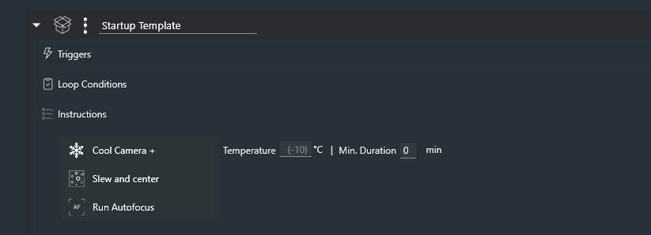
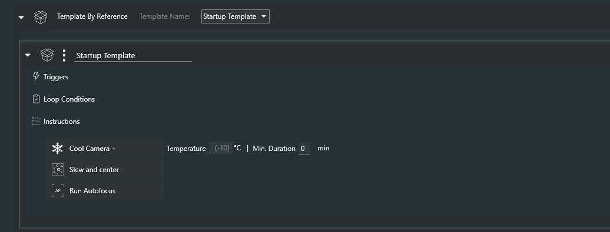
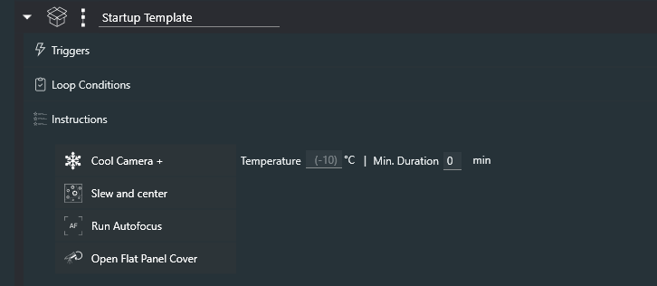
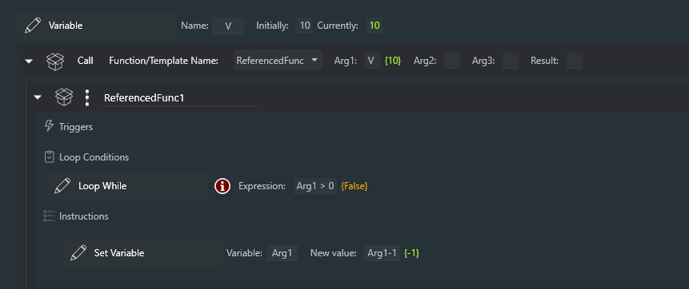
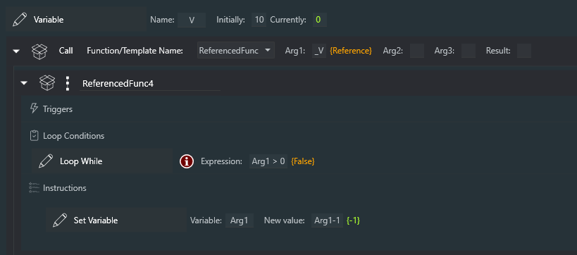
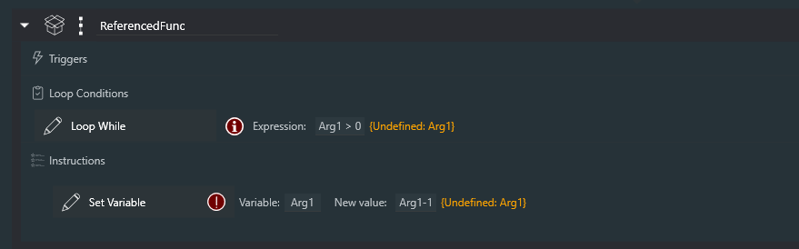
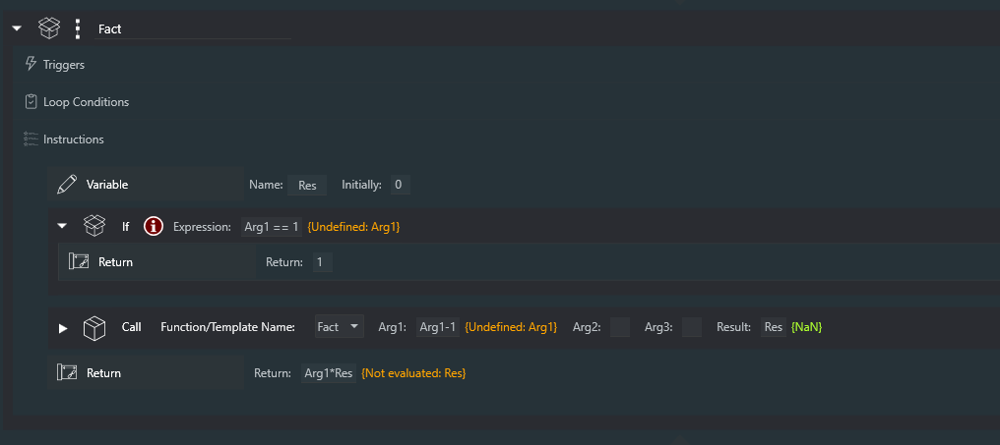
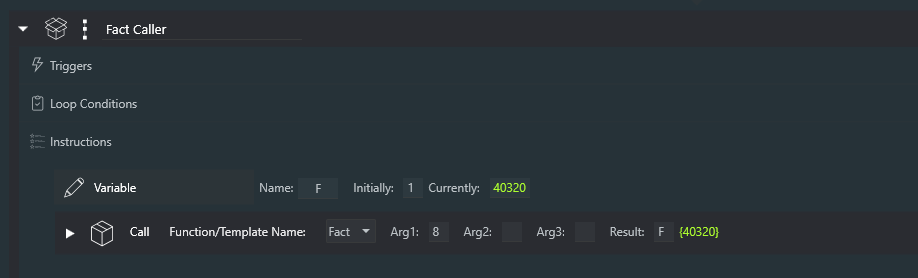
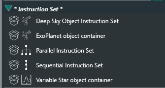
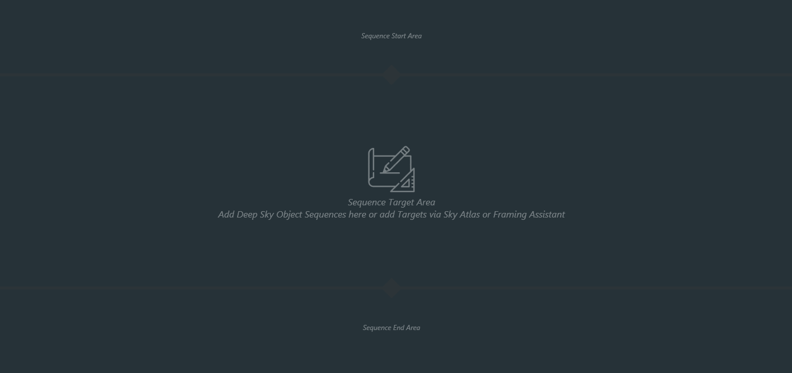

# **Template by Reference**

## Template by Reference - Rationale

If you use NINA Templates in your sequences, you'll find that **Template by Reference** is one of the most powerful features of Sequencer Powerups. In effect, they turn your Templates into something more akin to "subroutine calls" or "macros". It's easiest to show this with examples.

Let's say you have a startup Template like this that cools the camera, slews and centers the target, and runs autofocus:

If you use this in different Templates, Targets, or Sequences (I'll just call all of these "sequences" for simplicity), you'll have these three instructions repeated in each of them. Now let's say you add something new to your startup procedure, like opening an automated flat cover. To update your existing sequences, you'll have to go into each one and add the new instruction. Not only is this tedious, it's also very error prone - you might make a mistake in updating some sequences, for example, or you might simply forget to update some sequences altogether.

With **Template by Reference**, all of this repetition goes away.  Simply add the instruction to your Sequences, and use the picker to select the Template you want to reference.  So now you have this:

## Usage

When using a **Template by Reference** instruction in a sequence, you can use the arrow on the left side of the instruction to expand it.

Let's say I now want to update my **Startup Template** by adding an instruction for my new flat device. After the simple edit, it might look like this:

Now, save the Template as you usually would, by clicking on the floppy disc icon on the right side of the screen.  Having done this, and if you are using **Template by Reference** specifying **Startup Template** in other sequences, you will find that they will *all* be using the updated version of **Startup Template**.

*Extra credit for recognizing the idiocy of where I added the Open Flat Panel Cover instruction*

*Note: Template by Reference does not work when loading a startup sequence from the command line!*

## How Does This Work?

To use **Template by Reference** to its fullest potential, it helps to understand how it works. And it's really very simple. The **Template by Reference** instruction simply *refers* to the specified Template by its name.

The "magic" comes when you *load* a sequence with one or more **Template by Reference** instructions into the Advanced Sequencer; at that time, all **Template by Reference** instructions *copy* in the most recent version of the referenced Template into the sequencer. At that point, it is exactly as though you copied the Template into your sequence, and you can edit it, save it, or just use it as is.

If you *edit* the contents of a **Template by Reference** that you've expanded in a sequence, those changes are *local*; they do *not* propagate to other sequences. But what if you *want* to make changes *and* have those changes be "seen" by other sequences? That's simple: just *save* the Template as you would save any other template.

Again, this all makes sense if you remember that **Template by Reference** *copies* the Template into your sequence *when it is loaded into the Advanced Sequencer*.

## Confused?

At first, some of this might seem confusing, though I've tried to make it comprehensible. If you have questions, please don't hesitate to ask on the #sequencer-powerups channel in the NINA Discord.

# **Functions**

Functions are Templates that can be called with up to six arguments, and can return a value (by setting a **Variable**).  They are similar to **Template by Reference** in that they refer to a Template by name, but they act somewhat differently as will be described below.

## What are They For?

I'm not really sure, so I'm hoping you'll let me know if you find a use for them (other than demonstrating the power of NINA's plugin system).

## The **Call** and **Return** instructions

The **Call** instruction can specify up to three arguments, and a **Variable** name that can store a return value.  *All three arguments, as well as the return value, are optional.*  A **Call** with neither arguments nor a return value is simply another way of executing a Template.  Arguments can be passed by value or by reference.  To pass an argument by reference, use an underscore as a prefix before the name of the **Variable**.   So the argument "Count" refers to the *value* of the Count **Variable**; the argument `_Count` refers to a *reference to the Count variable*. For those unfamiliar with the concept of a "reference" (also called a "pointer"), read on.

A **Function** is just a Template, but when it's used, there are some differences:

1) The template is loaded *when it is called*, which is unlike **Template by Reference** (TBR) which loads the template when the TBR is loaded into the sequence.

2) The **Variables** Arg1, Arg2, etc. are assigned to the arguments specified in the **Call** instruction (all are optional). If an argument is of the form `_xxx`, where xxx is the  name of a **Variable**, then the argument is passed as a *reference* to the **Variable** specified.

3) The (new) **Return** instruction can be used at any time in the Template to cause the called Template to return.  If a value is included in the **Return** instruction, and if there is a **Variable** specified in the **Call** instruction, that **Variable** will be assigned the **Return** value.

Here's an example of an argument passed by value.  Below, the code has run; the Template "ReferencedFunc" has been called, and the **Loop While** has run 10 times, ending with `Arg1` having a value of zero.  The **Loop While** expression is false.

Here's the same example, but the argument is passed as a *reference* to the **Variable** V.  The result is very similar; the **Loop While** runs 10 times, the Arg1 **Variable** decrements to zero, but notice that the *reference* **Variable** V is now also zero.   That's because, while executing the **Template**, the instruction **Set Variable** of Arg1 is actually setting the value of **Variable** V that Arg1 references.  *The distinction is important!*

And here's the Template "ReferencedFunc".  You'll notice that the **Variable** Arg1 appears undefined, which makes sense actually; it will get defined automatically when the Template is **Call**ed.

##Recursion

Yes, Powerups **Functions** can be recursive.  Here's a Template called "Fact" that calculates "factorial" of its argument.

And here's 8! (8 factorial, as calcualted by the Sequencer)

## Appendix: What are Sequences and Templates Anyway??

There is often a great deal of confusion with what is meant by a **Sequence**, as opposed to a **Template** in NINA (And then there are **Targets**, but you're on your own there).

### Templates

A NINA **Template** is an *instruction set* that you have saved with the instruction set's floppy disk button. Here are the built in types of instruction set, along with another one (Variable Star object container) that was created by a plug-in.

You can see the floppy disc icon here on the right side of the screen:

When you save an instruction set with the floppy disc button, a **Template** is created with a name you can choose. In the example above, the name of the **Template** would be named "Parallel Instruction Set" (not a very good name). *Note that the state of the Template is not saved; all loop counts, exposure counts, and the like are reset when the Template is saved!*

A **Template** can contain any number of instructions, instruction sets, **Templates**, and **Targets**,

### Sequences

**Sequences** in NINA represent the entire contents of the Advanced Sequencer at any given point in time; that is, it includes the "Sequence Start Area", the "Sequence Target Area", and the "Sequence End Area".  They are loaded and saved with icons at the lower left of the Advance Sequencer. *Note: When you save a Sequence, the state of the Sequence is preserved - that means that loop counters, exposure counts, and the like are remembered and restored when that Sequence is loaded!*

These things are described more fully, but with some inconsistencies in terminology, at [NINA Advanced Sequencer](https://nighttime-imaging.eu/docs/develop/site/sequencer/advanced/advanced/)

