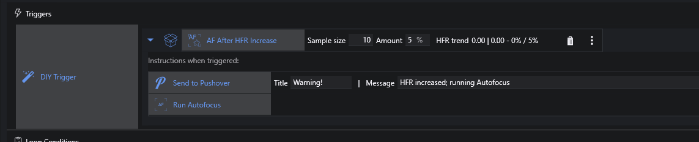

# Triggers

Sequencer Powerups defines four new Triggers that can be helpful in some circumstances.

## DIY Trigger

NINA Triggers "fire" between the execution of instructions in a Sequence if the triggering condition is met (note that the **When** and **When Becomes Unsafe** Triggers in Sequencer Powerups act differently; they will "fire" within seconds of the condition being met).  Triggers internally have two parts: 1) checking the condition, and 2) taking some appropriate action or actions.

So, for example, the built-in **Meridial Flip** Trigger, between instructions, 1) checks if it's time for a Meridian Flip, and 2) if it is, takes the requisite actions - stop guiding, wait to pass the meridian, slew back to the target, etc.

The **DIY Trigger** deconstructs the two parts of a Trigger.  You get to specify 1) the existing Trigger whose triggering condition you want to use, and 2) specify the instructions that NINA will execute when that triggering condition is met.

In this simple example, we use the triggering condition of **AF After HFR Increase**; when triggered, we use **Run Autofocus** (to do the actual autofocus, but *in addition* we send ourselves an alert:

## Safe Trigger

This is exactly like **DIY Trigger** but the trigger will only trip if conditions are "Safe".

## Autofocus Trigger

There are times when, looking at your running sequence, you think that *this* would be a good time for running Autofocus (maybe something looks wrong with an image, or you worry that conditions have changed enough to require one *right now*).  This is what **Autofocus Trigger** is for; simply drop the trigger into your sequence, and an Autofocus will be run as soon as the currently executing instruction has finished.  **Note that you should delete the instruction after the Autofocus has started!**

## Interrupt Trigger

**Interrupt Trigger** is similar to **Autofocus Trigger** in that it trips after the currently running instruction (just drop it into Triggers); instead of running an Autofocus, you can specify whatever instruction(s) you like.  And, as with **Autofocus Trigger**, this is intended to be a one-time operation.
