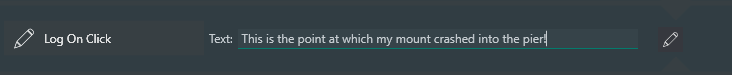

# This & That

Here are some other instructions you might find useful...

## Repeat Until All Succeed

This instruction will loop through the included instructions until none of them fail.  This might be useful at startup time to make sure all of your equipment is running properly before starting imaging. As soon as any of the instructions fails, NINA will pause for the amount of time you specify and then try again.

## Wait Indefinitely

This instruction, well, waits indefinitely.

## Breakpoint

This is exactly the same as **Wait Indefinitely** except that it throws up a NINA warning.

## End Sequence

This instruction ends the entire sequence that is running.

## End Instruction Set

This instruction terminates the instruction you specify, anywhere in the hierarchy of running instructions.

## Log on Click

This instruction allows you to add arbitrary text to the NINA log. This might be useful when reporting bugs in being able to mark the time and cicrumstance under which something or other happened.

The **Log on Click** instruction can be put *anywhere* in a sequence; it does *not* get executed, ever.  To add your note to the NINA log, just enter text and, when you're ready, click on the button to the right of the text field (the icon looks like a pen).

## Flip Rotator

Some users will need to flip the rotator position after a Meridian Flip; this instruction will flip the rotator by 180 degrees

