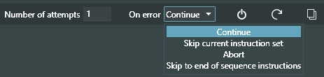
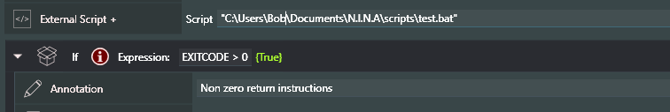

#External Script +

This is an enhanced version of the existing NINA instruction, External Script. The key difference is that now you can pass Variable values to a script and, even better, receive a value back into your sequence.

The 'External Script' command allows you to execute a Windows batch file, enabling you to perform various tasks such as launching other programs, copying files at the end of a session, or terminating other Windows processes.

External Script +' does the same with two enhancements, pass variable values to the called script and receive back a single value from the script in the new Variable (reserved word) **EXITCODE**.

The **EXITCODE** can be in the range of -2147483648 to 2147483647 and is set in a script as the windows batch variable %ERRORLEVEL% by way of the script line EXIT /b

### Passing Values to a Script

There are two ways to pass data to an external script, as follows - 

In the form of a value substituted string:
"C:\Users\Bob\Documents\N.I.N.A\scripts\logger.bat" "HFR: {hfr}  Focus: {focuspos}  Temp: {temp}" >> "C:\Users\Bob\Documents\N.I.N.A\scripts\logger.log" 2>>&1

In the form of discrete values:
"C:\Users\Bob\Documents\N.I.N.A\scripts\logger.bat" {hfr} {focuspos} {temp} >> "C:\Users\Bob\Documents\N.I.N.A\scripts\logger.log" 2>>&1

### Breaking down the External Script + command line into its components:

#### "C:\Users\Bob\Documents\N.I.N.A\scripts\logger.bat"

(Required) This is the fully qualified name of the batch file being called. If it contains a space it must be enclosed in quotes so its good practice to do that always. The script can be located anywhere on your system but a new subdirectory in Documents->N.I.N.A. is suggested

#### "HFR: {hfr}  Focus: {focuspos}  Temp: {temp}" or {hfr} {focuspos} {temp}

(Optional) The value substituted string or the discrete values are passed as batch command line input arguments to the script. The Variable names enclosed in curly braces **{variable}** are substituted with current Variable values.

#### >>  or >

(Optional) Redirect STDOUT to a file. The >> format creates a new file if it does not exist or appends to an already existing file. The > format erases any existing file and creates a new file.
 
#### "C:\Users\Bob\Documents\N.I.N.A\scripts\logger.log"
(Required only for redirect above) The file name to which the STDOUT will be redirected. The output file can be located anywhere on your system. Its good practice to enclose the name in quotes in case there is a space in one of the directory names or file name. 

#### 2>>&1

(Optional) Additionally redirect the windows STDERR to STDOUT. Any error message that may occur in the script will also be captured into the redirected output file 

The batch script file being called can set internal variables to the corresponding position of the passed values. A simple example of the logger.bat script referenced above with three value inputs would be as follows:

@echo off
set arg1=%1
set arg2=%2
set arg3=%3
echo %arg1%
echo %arg2%
echo %arg3%

Any echo command causes the value to output to windows STDOUT and if being redirected to a file, will be added to the file.

### Receiving Values from a Script 

N.I.N.A. treats any non-zero return value from a script as an error. In reality, the error value is data which can be assigned to a variable.

The same capability to control execution on a non-zero return code exits as with ‘External Script’

But regardless of the action chosen, the new reserved word **EXITCODE** is set to the returned value and can be used in expressions or as a Variable value.

Testing on the value of **EXITCODE**

Assigning the value of **EXITCODE** to a Variable and using that value for example as a wait time in the new **Wait for Time Span +**git instruction

